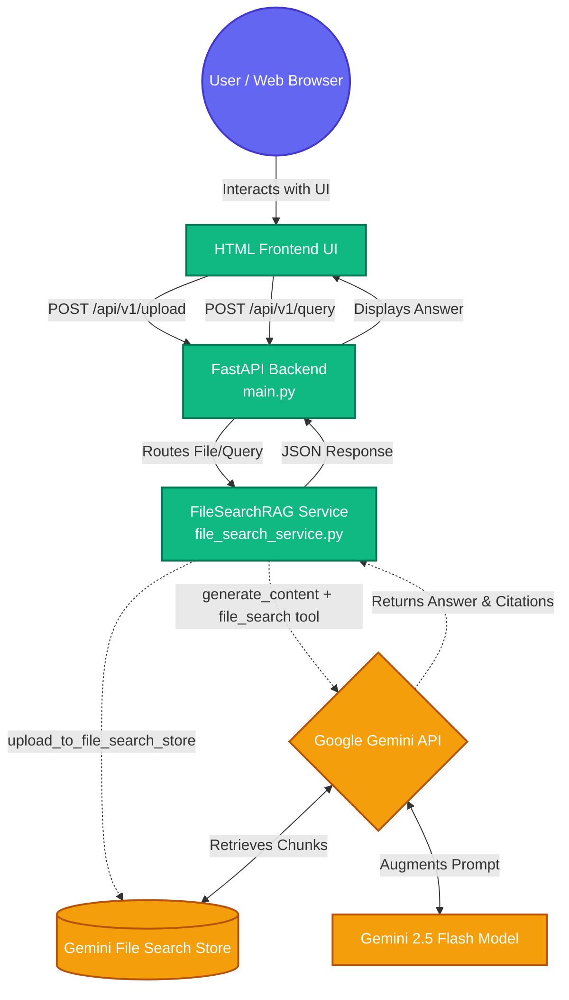

# Gemini File Search RAG Demo

Self-contained demo that mirrors the **Vertex AI RAG** UI style, but uses **[Gemini File Search](https://ai.google.dev/gemini-api/docs/file-search)** so Google handles **import, chunking, embedding, and retrieval**—no Firestore, GCS pipeline, or custom vector code.

## 🏗 System Architecture

The following diagram illustrates how the components of this application interact with each other and the Google Gemini API to provide a seamless Retrieval-Augmented Generation (RAG) experience.



## 📁 File Structure & Explanations

Here is a breakdown of what each critical file in this repository does:

- **`main.py`**: The entry point of the application. It initializes the FastAPI server and serves the HTML frontend (which is embedded directly in this file). It defines the API routes (`/health`, `/api/v1/status`, `/api/v1/upload`, `/api/v1/query`) and handles incoming HTTP requests, validating inputs before passing them to the service layer.
- **`file_search_service.py`**: The core backend logic. Contains the `FileSearchRAG` wrapper class which interacts directly with the `google-genai` Python SDK. It handles:
  - Creating or reusing a File Search Store (`ensure_store`).
  - Directly uploading documents to the vector store (`upload_to_file_search_store`).
  - Executing LLM queries with the `file_search` tool enabled, and parsing out the resulting answers, citations, and grounding metadata.
- **`config.py`**: The configuration module. It centrally manages environment variables (like `GEMINI_API_KEY`, `FILE_SEARCH_STORE_NAME`, and `GEMINI_MODEL`) and defines the list of allowed file extensions (`ALLOWED_EXTENSIONS`) to ensure unsupported files (like images) aren't uploaded to the vector store.
- **`Dockerfile`**: Contains instructions for containerizing the application. Useful for deploying the app to Google Cloud Run or any other container platform. It uses a lightweight Python 3.11 image and exposes port 8080.
- **`requirements.txt`**: Declares the Python dependencies (`fastapi`, `uvicorn`, `python-multipart`, and `google-genai`).

## 🚀 Quick start (local)

```bash
cd RAG-FileSearch-Demo
python3 -m venv .venv
source .venv/bin/activate   # Windows: .venv\Scripts\activate
# Always install with the venv’s Python (not global pyenv) so google-genai matches `python main.py`
python -m pip install -U -r requirements.txt

export GEMINI_API_KEY="your-key"   # AI Studio / Google AI
# optional:
# export GEMINI_MODEL="gemini-2.5-flash"
# export FILE_SEARCH_STORE_NAME="fileSearchStores/..."  # pin an existing store
# export FILE_SEARCH_STORE_DISPLAY_NAME="my-demo-store"    # reuse by display name

python main.py
```

Open **http://127.0.0.1:8080** — upload files, then ask questions. Citations / grounding metadata appear in the UI when the API returns them.

## 🛠 Troubleshooting

- **`Requested entity was not found` / `404 NOT_FOUND` on Upload** — Gemini File Search only supports text-based documents (PDF, TXT, DOCX, CSV, MD). Attempting to upload image files to the File Search endpoint will result in a 404 error from the Google backend. Ensure you only upload supported documents.
- **`importFile` / upload returns `404 NOT_FOUND` while `fileSearchStores.get` is `200`** — The demo now utilizes `upload_to_file_search_store` to bypass the deprecated two-step `Files API upload -> importFile` pipeline which often failed with 404s.
- **`AttributeError: 'Client' object has no attribute 'file_search_stores'`** — Your `google-genai` install is older than **1.49.0**. Reinstall deps **using the same Python that runs the app** (common mistake: upgrading pyenv global while the app uses `.venv`).
- **`ResolutionImpossible` / `anyio` conflict** — Old FastAPI (0.104.x) required `anyio<4`, but `google-genai>=1.49` needs `anyio>=4.8`. This repo pins **FastAPI ≥ 0.115** so both resolve; run `pip install -U -r requirements.txt` again.

## ☁️ Cloud Run Deployment

File Search in the Python SDK is wired to the **Gemini Developer API** (API key), not Vertex. Deploy like any other container; **inject the key** via Secret Manager or `--set-secrets`:

```bash
gcloud run deploy gemini-file-search-demo \
  --source . \
  --region=us-central1 \
  --allow-unauthenticated \
  --set-secrets=GEMINI_API_KEY=YOUR_SECRET:latest
```

*(If you ever wish to place this behind IAP for production so only authorized users can access it, you will need to setup a Global External Application Load Balancer and Serverless NEGs).*

## 🔌 API

- `GET /health` — liveness  
- `GET /api/v1/status` — key configured, model name  
- `POST /api/v1/upload` — multipart `file`  
- `POST /api/v1/query` — JSON `{"query": "..."}`  

Interactive docs: `/docs`
