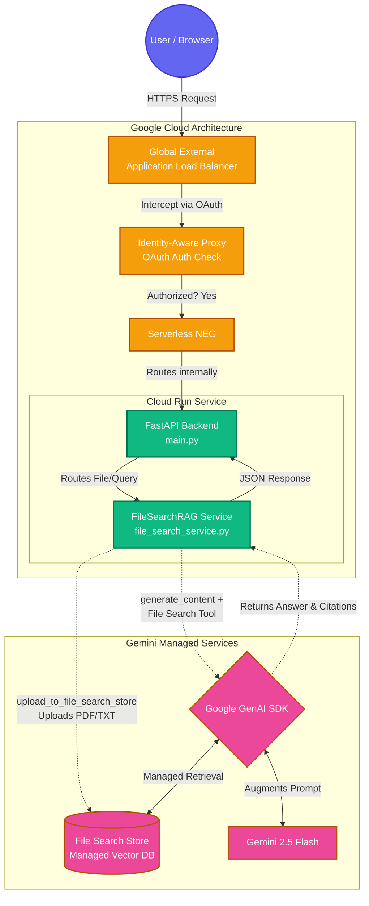

# Gemini File Search RAG Demo

A complete, self-contained demonstration of building a **Retrieval-Augmented Generation (RAG)** application leveraging the **[Gemini File Search API](https://ai.google.dev/gemini-api/docs/file-search)** and deploying it securely on Google Cloud.

## 🧠 What is Gemini File Search?

Typically, building a RAG application requires immense effort:
1. **Parsing & OCR:** Extracting text from PDFs, Word docs, and Markdown.
2. **Chunking:** Writing custom logic to split large documents into overlapping semantic blocks.
3. **Embeddings:** Passing those chunks through an embedding model to convert them into vectors.
4. **Vector Database:** Provisioning and managing a custom database (like Pinecone, Weaviate, or Firestore Vector Search) to store the embeddings.
5. **Retrieval Logic:** Writing code to calculate cosine similarity and manually retrieve the top-K chunks to inject into your LLM prompt.

**Gemini File Search handles *all* of the above behind the scenes!** 
You simply upload your raw documents (PDF, Office, TXT, CSV) to a `fileSearchStore`. When you query the Gemini model, you pass the store's name as a tool. Google automatically chunks, embeds, indexes, retrieves, and returns the exact answer alongside source citations and grounding metadata.

---

## 🏗 System Architecture

The following diagram illustrates how the system operates, including the **Google Cloud Run** deployment secured by **Identity-Aware Proxy (IAP)**.



---

## 📁 File Structure & Explanations

Here is a breakdown of what each critical file in this repository does:

- **`main.py`**: The entry point of the application. Initializes the **FastAPI** server and serves the HTML frontend (which is embedded directly inside). It exposes the API routes (`/health`, `/api/v1/upload`, `/api/v1/query`) and translates web requests to backend service calls.
- **`file_search_service.py`**: The core AI logic. Contains the `FileSearchRAG` class which interacts directly with the `google-genai` Python SDK. It handles:
  - Creating or reusing the vector storage (`ensure_store`).
  - Securely dispatching documents into Google's processing pipeline (`upload_to_file_search_store`).
  - Executing LLM queries with the `file_search` tool enabled, and parsing out answers and citations.
- **`config.py`**: A configuration module that securely imports environment variables (like `GEMINI_API_KEY` and `FILE_SEARCH_STORE_NAME`) and maintains `ALLOWED_EXTENSIONS` (ensuring invalid files like images are rejected early).
- **`Dockerfile`**: Instructions for containerizing the application using a lightweight Python 3.11 image, ready for Google Cloud Run.
- **`requirements.txt`**: Python dependencies (`fastapi`, `uvicorn`, `python-multipart`, and `google-genai`).

---

## 🚀 Local Deployment / Usage

To run the application on your computer for testing:

```bash
# 1. Setup python virtual environment
python3 -m venv .venv
source .venv/bin/activate

# 2. Install dependencies
python -m pip install -U -r requirements.txt

# 3. Export your Google Gemini API Key
export GEMINI_API_KEY="your-api-key-here"

# 4. Start the server
python main.py
```

Open **http://127.0.0.1:8080** in your browser.

---

## ☁️ Cloud Deployment (Cloud Run + IAP)

Running this publicly requires securing it. By utilizing **Identity-Aware Proxy (IAP)**, you ensure that only authorized users (authenticated via their Google Account) can access your Cloud Run instance. 

### Step 1: Deploy to Cloud Run
Deploy the application, restricting access so it can **only** be reached from a load balancer:
```bash
gcloud run deploy gemini-file-search-demo \
  --source . \
  --region=asia-south2 \
  --allow-unauthenticated \
  --ingress=internal-and-cloud-load-balancing \
  --set-env-vars="GEMINI_API_KEY=YOUR_API_KEY_HERE"
```

### Step 2: Provision Load Balancer Infrastructure
To put IAP in front of Cloud Run, you must build a Global External HTTPS Load Balancer using a **Serverless Network Endpoint Group (NEG)**.

```bash
IP_ADDRESS="34.149.147.50" # Replace with a static IP you reserve via GCP
DOMAIN="${IP_ADDRESS}.nip.io"
REGION="asia-south2"

# Create the NEG routing traffic to Cloud Run
gcloud compute network-endpoint-groups create demo-neg \
    --region=$REGION \
    --network-endpoint-type=serverless  \
    --cloud-run-service=gemini-file-search-demo

# Create the Backend Service
gcloud compute backend-services create demo-backend \
    --global \
    --load-balancing-scheme=EXTERNAL_MANAGED

# Attach NEG to Backend
gcloud compute backend-services add-backend demo-backend \
    --global \
    --network-endpoint-group=demo-neg \
    --network-endpoint-group-region=$REGION

# Routing, Target Proxies, and SSL Certs (Required for IAP)
gcloud compute url-maps create demo-url-map --default-service demo-backend
gcloud compute ssl-certificates create demo-cert --domains=$DOMAIN --global
gcloud compute target-https-proxies create demo-https-proxy --url-map=demo-url-map --ssl-certificates=demo-cert
gcloud compute forwarding-rules create demo-https-rule --load-balancing-scheme=EXTERNAL_MANAGED --network-tier=PREMIUM --address=$IP_ADDRESS --target-https-proxy=demo-https-proxy --global --ports=443
```

### Step 3: Enable IAP

First, ensure you have configured an **OAuth Consent Screen** and an **OAuth Web Application Client ID** in Google Cloud Console. Then, enable IAP on your load balancer's backend.

```bash
# Provide the Client ID / Secret and enable IAP
gcloud compute backend-services update demo-backend \
    --global \
    --iap=enabled,oauth2-client-id="YOUR_CLIENT_ID",oauth2-client-secret="YOUR_CLIENT_SECRET"

# Give the IAP proxy permission to "Invoke" your internal Cloud Run service
gcloud beta services identity create --service=iap.googleapis.com --project=YOUR_PROJECT_ID
gcloud run services add-iam-policy-binding gemini-file-search-demo \
    --region=$REGION \
    --member="serviceAccount:service-YOUR_PROJECT_NUMBER@gcp-sa-iap.iam.gserviceaccount.com" \
    --role="roles/run.invoker"

# Grant yourself permission to pass through the IAP wall
gcloud iap web add-iam-policy-binding \
    --resource-type=backend-services \
    --service=demo-backend \
    --member="user:your-email@gmail.com" \
    --role="roles/iap.httpsResourceAccessor"
```

Wait up to 30 minutes for the managed SSL certificate to become active, then navigate to your mapped domain (`https://[IP].nip.io`). You will be prompted with a Google Login before safely accessing your app!
