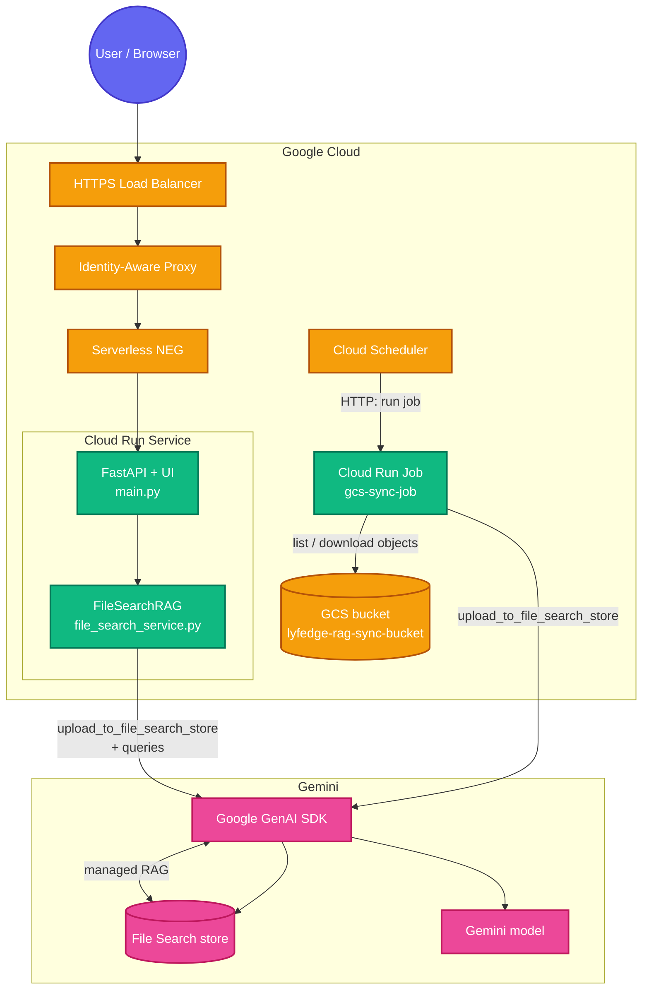

# Gemini File Search RAG Demo

A complete, self-contained demonstration of building a **Retrieval-Augmented Generation (RAG)** application leveraging the **[Gemini File Search API](https://ai.google.dev/gemini-api/docs/file-search)** and deploying it securely on Google Cloud.

## 🧠 What is Gemini File Search?

Typically, building a RAG application requires immense effort:

1. **Parsing & OCR:** Extracting text from PDFs, Word docs, and Markdown.
2. **Chunking:** Writing custom logic to split large documents into overlapping semantic blocks.
3. **Embeddings:** Passing those chunks through an embedding model to convert them into vectors.
4. **Vector Database:** Provisioning and managing a custom database (like Pinecone, Weaviate, or Firestore Vector Search) to store the embeddings.
5. **Retrieval Logic:** Writing code to calculate cosine similarity and manually retrieve the top-K chunks to inject into your LLM prompt.

**Gemini File Search handles *all* of the above behind the scenes.**  
You upload raw documents to a **File Search store**. When you query the Gemini model, you pass the store’s name as a tool. Google chunks, embeds, indexes, retrieves, and can return answers with citations and grounding metadata.

---

## 🏗 System Architecture

This repo supports **two ways** to get documents into the same File Search store:

| Path | Purpose |
|------|--------|
| **FastAPI UI / API** (`main.py`) | Interactive upload for demos and ad-hoc files. |
| **GCS → Cloud Run Job** (`gcs-sync-job/`) | Batch / scheduled sync from a canonical bucket into File Search (embeddings & indexing). |

The diagram below includes the **GCS sync bucket**, **Cloud Run Job**, and optional **Cloud Scheduler**. IAP + Load Balancer remain the pattern for locking down the web UI.



---

## ❓ Why use a GCS sync job?

1. **Canonical source of truth** — Teams drop PDFs, DOCX, TXT, etc. into **`gs://lyfedge-rag-sync-bucket`** (upload UI, `gsutil`, pipelines). The job is the single pipeline that **embeds and indexes** those objects into File Search.
2. **No reliance on interactive “agent” quotas** — Tools such as **Antigravity** (or other IDE agents) can hit **daily/API quotas** when they drive uploads repeatedly. A **Cloud Run Job** runs under **your** project controls, on a **schedule** you choose, with predictable batch behavior.
3. **Incremental sync** — The job stores **MD5 hashes** in **`.sync_state.json`** in the same bucket so only **new or changed** objects are re-indexed; removed GCS objects can be removed from the store.
4. **Separation of concerns** — The **web app** answers questions; the **job** handles **bulk ingestion** from GCS without keeping long-lived upload sessions in the browser.

---

## 🪣 GCS bucket: `lyfedge-rag-sync-bucket`

- **Name (example):** `lyfedge-rag-sync-bucket` — replace with your bucket if different.
- **Region:** Align with **Cloud Run Job** and **Scheduler** (e.g. `asia-south2`).
- **Contents:**
  - **Documents** to index: `pdf`, `doc`, `docx`, `txt`, `md`, `csv` (see `gcs-sync-job/sync_job.py`).
  - **State object:** `.sync_state.json` (created by the job — maps blob path → MD5; **do not delete** unless you want a full re-sync).
- **Permissions:** The job’s service account needs at least **`roles/storage.objectViewer`** to read objects and **`roles/storage.objectAdmin`** (or a custom role) to **write** `.sync_state.json`. Narrow to this bucket via a **bucket-level IAM binding** if possible.

Create the bucket (example):

```bash
export PROJECT_ID=lyfedge-project
export REGION=asia-south2
export BUCKET=lyfedge-rag-sync-bucket

gcloud config set project "$PROJECT_ID"
gsutil mb -p "$PROJECT_ID" -l "$REGION" "gs://$BUCKET"
```

---

## ⚙️ Cloud Run Job — `gcs-sync-job/`

Batch container that:

1. Reads **`GCS_BUCKET_NAME`** (use `lyfedge-rag-sync-bucket`).
2. Loads **`GEMINI_API_KEY`** (from env or Secret Manager).
3. Resolves or creates a File Search store by **`FILE_SEARCH_STORE_DISPLAY_NAME`** (must match the **same** value you use for the FastAPI app’s `FILE_SEARCH_STORE_DISPLAY_NAME` / store discovery so UI and job share one store).
4. Downloads **new/changed** blobs (vs `.sync_state.json`), calls **`upload_to_file_search_store`**, waits for the long-running operation.
5. Deletes **stale** store documents when a blob disappears from GCS.
6. Writes updated **`.sync_state.json`** back to the bucket.

| File | Role |
|------|------|
| `gcs-sync-job/sync_job.py` | Main logic: list GCS, diff MD5, Gemini upload, delete, state. |
| `gcs-sync-job/Dockerfile` | Python 3.11 image; `CMD ["python", "sync_job.py"]`. |
| `gcs-sync-job/requirements.txt` | `google-genai>=1.49.0`, `google-cloud-storage>=2.14.0`. |

**Environment variables (job):**

| Variable | Required | Description |
|----------|----------|-------------|
| `GCS_BUCKET_NAME` | Yes | e.g. `lyfedge-rag-sync-bucket` |
| `GEMINI_API_KEY` | Yes | Gemini Developer API key |
| `FILE_SEARCH_STORE_DISPLAY_NAME` | No | Default in code: `Gemini File Search demo` — **set explicitly** to match `config.py` / Cloud Run service (e.g. `rag-filesearch-demo`) |

**Authentication:** The job uses **API key** for Gemini and the **metadata server / ADC** for GCS via `google-cloud-storage` — run it with a **service account** that has GCS access on the bucket (Cloud Run Job default SA or a dedicated SA).

---

## 🚀 Deploy the Cloud Run Job

Prerequisites: APIs enabled — `run.googleapis.com`, `storage.googleapis.com`, `cloudscheduler.googleapis.com`, `secretmanager.googleapis.com` (if using secrets).

```bash
export PROJECT_ID=lyfedge-project
export REGION=asia-south2
export BUCKET=lyfedge-rag-sync-bucket
export JOB_NAME=rag-gcs-file-search-sync
export REPO=gcr.io/${PROJECT_ID}/${JOB_NAME}

gcloud config set project "$PROJECT_ID"

# 1) Secret for API key (recommended)
echo -n "YOUR_GEMINI_API_KEY" | gcloud secrets create gemini-api-key --data-file=- 2>/dev/null \
  || echo -n "YOUR_GEMINI_API_KEY" | gcloud secrets versions add gemini-api-key --data-file=-

# 2) Dedicated SA (optional but recommended)
gcloud iam service-accounts create rag-gcs-sync-sa --display-name="RAG GCS File Search sync"
SYNC_SA="rag-gcs-sync-sa@${PROJECT_ID}.iam.gserviceaccount.com"

gsutil iam ch serviceAccount:${SYNC_SA}:objectViewer "gs://${BUCKET}"
gsutil iam ch serviceAccount:${SYNC_SA}:objectAdmin "gs://${BUCKET}"

gcloud secrets add-iam-policy-binding gemini-api-key \
  --member="serviceAccount:${SYNC_SA}" --role="roles/secretmanager.secretAccessor"

# 3) Build image
cd gcs-sync-job
gcloud builds submit --tag "$REPO" .

# 4) Create job
gcloud run jobs create "$JOB_NAME" \
  --image="$REPO" \
  --region="$REGION" \
  --service-account="$SYNC_SA" \
  --set-env-vars="GCS_BUCKET_NAME=${BUCKET},FILE_SEARCH_STORE_DISPLAY_NAME=rag-filesearch-demo" \
  --set-secrets="GEMINI_API_KEY=gemini-api-key:latest" \
  --max-retries=1 \
  --task-timeout=30m

# 5) Run once manually
gcloud run jobs execute "$JOB_NAME" --region="$REGION" --wait
```

Adjust `FILE_SEARCH_STORE_DISPLAY_NAME` to match your FastAPI / store naming. For a quick test only, you may use `--set-env-vars=GEMINI_API_KEY=...` instead of secrets (not recommended for production).

---

## ⏰ Cloud Scheduler — run the job on a schedule

Cloud Scheduler calls the **Cloud Run Jobs API** to **execute** the job (replace placeholders):

```bash
export PROJECT_ID=lyfedge-project
export REGION=asia-south2
export JOB_NAME=rag-gcs-file-search-sync
export SCHEDULER_SA=scheduler-invoker@${PROJECT_ID}.iam.gserviceaccount.com

gcloud iam service-accounts create scheduler-invoker --display-name="Run Cloud Run Jobs from Scheduler"

gcloud projects add-iam-policy-binding "$PROJECT_ID" \
  --member="serviceAccount:${SCHEDULER_SA}" \
  --role="roles/run.developer"

# Every 6 hours (cron)
gcloud scheduler jobs create http "${JOB_NAME}-schedule" \
  --location="$REGION" \
  --schedule="0 */6 * * *" \
  --uri="https://${REGION}-run.googleapis.com/apis/run.googleapis.com/v1/namespaces/${PROJECT_ID}/jobs/${JOB_NAME}:run" \
  --http-method=POST \
  --oauth-service-account-email="$SCHEDULER_SA"
```

**Note:** Exact Scheduler → Run Job wiring can vary slightly by API version; if the URI above fails, use the **“Create scheduler job”** flow in Cloud Console for **Cloud Run job** targets, or see [Run jobs on a schedule](https://cloud.google.com/run/docs/execute/jobs#schedule).

---

## 📁 File structure

| Path | Role |
|------|------|
| `main.py` | FastAPI app, embedded UI, `/health`, `/api/v1/upload`, `/api/v1/query`, `/api/v1/status`. |
| `file_search_service.py` | `FileSearchRAG`: store lifecycle, `upload_to_file_search_store`, queries + citations. |
| `config.py` | Env-based config (`GEMINI_API_KEY`, `GEMINI_MODEL`, `FILE_SEARCH_STORE_*`, allowed extensions). |
| `gcs-sync-job/sync_job.py` | GCS ↔ File Search sync job (MD5 state, deletes, `upload_to_file_search_store`). |
| `gcs-sync-job/Dockerfile` | Container image for the job. |
| `gcs-sync-job/requirements.txt` | Job dependencies. |
| `Dockerfile` (repo root) | Web service image for Cloud Run **service**. |
| `requirements.txt` | Web app dependencies. |

---

## 🚀 Local run (web app)

```bash
python3 -m venv .venv
source .venv/bin/activate
python -m pip install -U -r requirements.txt
export GEMINI_API_KEY="your-api-key-here"
python main.py
```

Open **http://127.0.0.1:8080**.

**Troubleshooting (venv):** use `python -m pip install …` with the same interpreter that runs `main.py`. **`google-genai>=1.49.0`** is required for File Search; **`fastapi>=0.115`** avoids `anyio` conflicts with `google-genai`.

---

## ☁️ Cloud Run service + IAP (web UI)

Running the UI publicly is often locked down with **Identity-Aware Proxy (IAP)** in front of a load balancer.

### Step 1: Deploy the Cloud Run **service** (repo root, not `gcs-sync-job/`)

```bash
gcloud run deploy gemini-file-search-demo \
  --source . \
  --region=asia-south2 \
  --allow-unauthenticated \
  --ingress=internal-and-cloud-load-balancing \
  --set-env-vars="GEMINI_API_KEY=YOUR_API_KEY_HERE,FILE_SEARCH_STORE_DISPLAY_NAME=rag-filesearch-demo"
```

Use **Secret Manager** for `GEMINI_API_KEY` in production. Keep **`FILE_SEARCH_STORE_DISPLAY_NAME`** aligned with the **GCS sync job** so both target the same logical store.

### Step 2: Load balancer + NEG (outline)

```bash
IP_ADDRESS="34.149.147.50"   # your reserved global IP
DOMAIN="${IP_ADDRESS}.nip.io"
REGION="asia-south2"

gcloud compute network-endpoint-groups create demo-neg \
    --region=$REGION \
    --network-endpoint-type=serverless \
    --cloud-run-service=gemini-file-search-demo

gcloud compute backend-services create demo-backend \
    --global \
    --load-balancing-scheme=EXTERNAL_MANAGED

gcloud compute backend-services add-backend demo-backend \
    --global \
    --network-endpoint-group=demo-neg \
    --network-endpoint-group-region=$REGION

gcloud compute url-maps create demo-url-map --default-service demo-backend
gcloud compute ssl-certificates create demo-cert --domains=$DOMAIN --global
gcloud compute target-https-proxies create demo-https-proxy \
  --url-map=demo-url-map --ssl-certificates=demo-cert
gcloud compute forwarding-rules create demo-https-rule \
  --load-balancing-scheme=EXTERNAL_MANAGED --network-tier=PREMIUM \
  --address=$IP_ADDRESS --target-https-proxy=demo-https-proxy --global --ports=443
```

### Step 3: IAP

Configure **OAuth consent** and a **Web client** in Google Cloud Console, then:

```bash
gcloud compute backend-services update demo-backend \
    --global \
    --iap=enabled,oauth2-client-id="YOUR_CLIENT_ID",oauth2-client-secret="YOUR_CLIENT_SECRET"

gcloud beta services identity create --service=iap.googleapis.com --project=YOUR_PROJECT_ID
gcloud run services add-iam-policy-binding gemini-file-search-demo \
    --region=$REGION \
    --member="serviceAccount:service-YOUR_PROJECT_NUMBER@gcp-sa-iap.iam.gserviceaccount.com" \
    --role="roles/run.invoker"

gcloud iap web add-iam-policy-binding \
    --resource-type=backend-services \
    --service=demo-backend \
    --member="user:your-email@gmail.com" \
    --role="roles/iap.httpsResourceAccessor"
```

Allow time for the managed certificate, then open `https://[IP].nip.io` and sign in with Google.

---

## 📝 Notes on quotas (e.g. Antigravity)

If you were using **Antigravity** or similar tools to drive uploads and hit **quota limits**, moving **bulk indexing** to **GCS + Cloud Run Job + Scheduler** avoids tying ingestion to those interactive limits. You still consume **Gemini / File Search billing** for indexing and queries; monitor usage in **Google AI Studio** and **Cloud Billing**.
