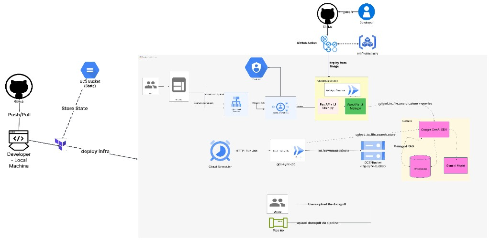

# RAG File Search demo (GCP)

Small FastAPI app plus a batch job: upload docs (or drop them in GCS), ask questions in plain English. Indexing goes through **Gemini File Search** — you are not maintaining chunking logic, embedding jobs, or a vector DB yourself. Details: [File Search docs](https://ai.google.dev/gemini-api/docs/file-search).

**What ships here**

- Web UI + API (`main.py`) — upload files, query with the File Search tool.
- `gcs-sync-job/` — Cloud Run Job that lists a bucket, diffs against `.sync_state.json`, pushes new/changed files into the same File Search store.
- `infra/terraform/` — optional one-shot deploy: Cloud Run service + job, GCS bucket, Scheduler, HTTPS LB + IAP, IAM. Adjust names/regions for your project; the examples in tfvars are from our env, not requirements.

---

## Architecture



Rough flow: Terraform/CI builds images → Cloud Run serves the app. Users hit the load balancer (IAP if enabled) → FastAPI → Gemini + File Search. Scheduler kicks the sync job on a cron; the job reads GCS and calls `upload_to_file_search_store`. Same `FILE_SEARCH_STORE_DISPLAY_NAME` on the service and the job so both sides talk to one store.

---

## Why not hand-rolled RAG

If you build RAG yourself you usually own parsers, chunking, embeddings, a vector store, and retrieval plumbing. File Search folds that into a managed path: you still own **where files land** (UI upload vs bucket) and **who can query** (IAP, IAM), but not the embedding pipeline.

---

## Prerequisites

`gcloud`, `terraform` (1.5+), a GCP project, and a Gemini API key. For Terraform: Secret Manager for the key, and OAuth client details if you use IAP.

---

## Clone

```bash
git clone https://github.com/anudishu/RAG-FileSearch-Demo.git
cd RAG-FileSearch-Demo
```

---

## Deploy with Terraform (outline)

1. `gcloud config set project YOUR_PROJECT`
2. Create a GCS bucket for Terraform state (example: `rag-system-lyfedge-project` — pick your own name).
3. Put the Gemini key in Secret Manager as `gemini-api-key` (or change the name in tfvars).
4. Build images — Cloud Build works if you do not want local Docker:

   ```bash
   export REGION=asia-south2
   export REPO="${REGION}-docker.pkg.dev/${PROJECT_ID}/rag-filesearch"
   gcloud artifacts repositories create rag-filesearch --repository-format=docker --location="$REGION" 2>/dev/null || true
   gcloud builds submit --tag "${REPO}/gemini-file-search-demo:latest" .
   gcloud builds submit --tag "${REPO}/rag-gcs-file-search-sync:latest" ./gcs-sync-job
   ```

5. `cd infra/terraform && cp terraform.tfvars.example terraform.tfvars` — fill project, images, IAP fields, `file_search_store_display_name` (must match on service + job). File is gitignored.
6. `terraform init` with your backend bucket/prefix. If the GCS backend complains about auth, `export GOOGLE_OAUTH_ACCESS_TOKEN="$(gcloud auth print-access-token)"` and pass `access_token` in backend config (see our earlier deploy notes).
7. `terraform apply`

Outputs include `app_url`, LB IP, and the shared store display name.

**Scheduler:** default cron is every 6 hours. For ~every 10 minutes set `scheduler_cron = "*/10 * * * *"` in tfvars. Scheduler runs in a region that supports it (`scheduler_region`, often not the same as Cloud Run).

---

## After apply

- Smoke-test the UI: upload a short txt, ask something only that file answers.
- GCS path: `gsutil cp file.pdf gs://YOUR_BUCKET/` then `gcloud run jobs execute rag-gcs-file-search-sync --region=REGION --wait` (or wait for Scheduler).
- Queries match **text inside** documents, not always the filename. If the body never mentions a name, asking for that name will miss.

---

## Local dev

```bash
python3 -m venv .venv && source .venv/bin/activate
pip install -r requirements.txt
export GEMINI_API_KEY="..."
python main.py
```

Needs `google-genai>=1.49` for File Search. App listens on `PORT` or 8080.

---

## Troubleshooting

- **503 / no API key** — secret missing or Run SA cannot read it.
- **Job skipped a file** — extension not in `gcs-sync-job/sync_job.py`, or object not visible to the job SA.
- **HTTPS** — wait until managed cert is ACTIVE; use the `https://` URL from output.
- **`terraform destroy` on a non-empty bucket** — empty the bucket first, or set `force_destroy` on the bucket resource if you accept that risk.

---

## Security

Do not commit `terraform.tfvars`, `.env`, or API keys. Rotate anything that ever leaked in chat or logs.

---

## Layout

| Path | Role |
|------|------|
| `main.py` | FastAPI + embedded UI |
| `file_search_service.py` | Store resolve/create, upload, query |
| `config.py` | Env config |
| `gcs-sync-job/` | Sync container |
| `infra/terraform/` | IaC |

More detail: `infra/terraform/README.md`.
